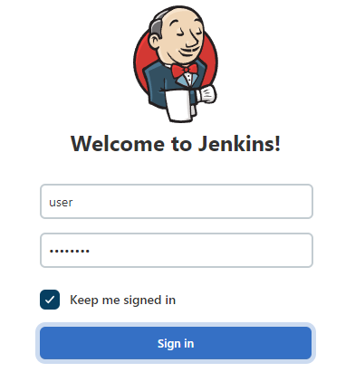
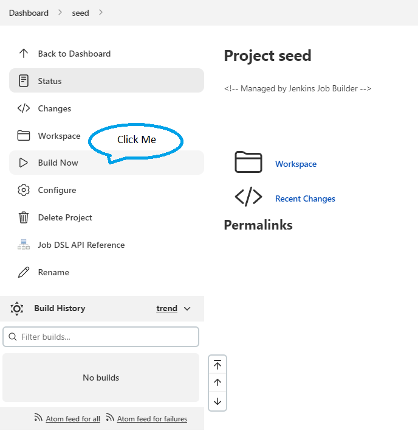
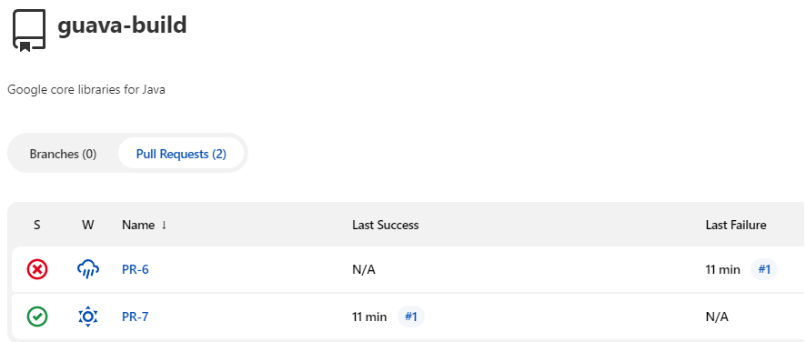
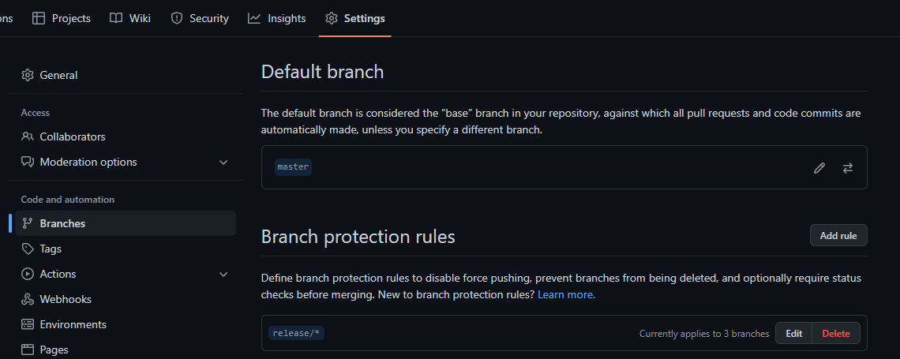
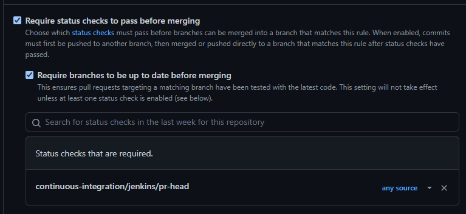
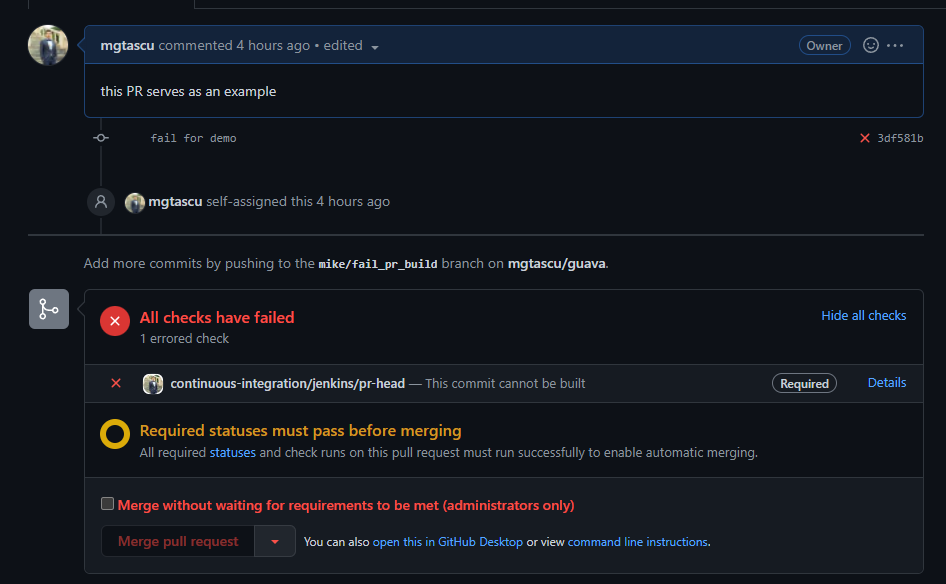
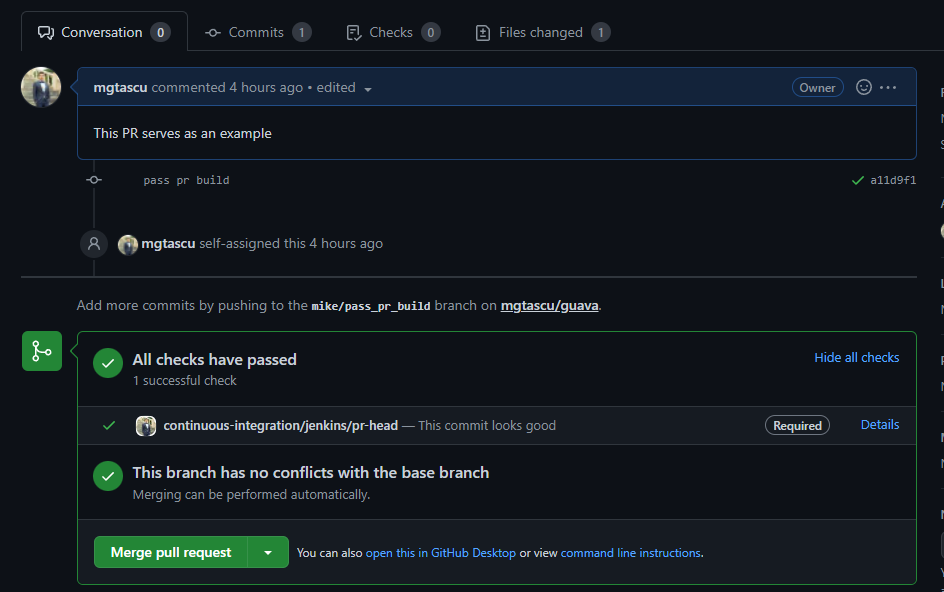

# Summary

Michael &amp; Sketch assignment solution repository. 

This repository will have all the code and documentation needed for the proposed exercises.
# Describing the solution (ex. 1)

The target of this solution is to have a tiny CI/CD environment for the [mgtascu/guava](https://github.com/mgtascu/guava) open-source project which was previously forked from [google/guava](https://github.com/google/guava). 
#### Approach
This solution is oriented on EaC(_everything as code_).
Some of the benefits from having EaC are:

* Reducing human intervnetion which is error prone
* A better solution management (versioning, portability, security, etc)
* Consistency and scalability

#### Tech stack
The underlying environment for the Jenkins server is cloud-based (`AWS`) which is provisioned through `terraform` IaC.

The Jenkins web-server is running inside a docker contaier, making it fast to install, running in an isolated environment, thus easy to replicate on another infrastructure. The configuration, plugins and the job are all generated by code, with little to none human interaction, with the help of DevOps tools like `JCasc`, `JobDSL`, `GroovyDSL`, `Jenkins Job Builder`.

`gurava` is a `java` with `maven` project, which usually means there are a lot of dependencies when running the build. Mounting the docker daemon into the Jenkins container, enables us to run the build itself in a separate container, prepared to execute the `maven` lifecycle of this build, therefore skipping the need to prepare an environemnt for the run.

The GitHub status checks are easy to install through the UI and for the purpose of this exercise I did so. However, there is are ways to automatically set them up, by making use of the graphql calls to the github's api, or by using terraform's github provider 

_Note: to run the solution as smoothly as possible, the configurability of the execution is reduced considerably, aiming to lessen the data needed._

# Prerequisites
Assuming there is an AWS account available, here is a list of requrements to run the soliution.
*  An environment with `awscli` and `terraform` installed.
    While developing the soltion, I used the a `t2.micro AWS EC2 instance` running Amazon Linux 2 and the following tool verions.
    > aws-cli/1.18.147 Python/2.7.18 Linux/5.10.109-104.500.amzn2.x86_64 botocore/1.18.6
    >
    > Terraform v1.1.9

* The `awscli` must be configured with the credentials of an IAM user with access to the AWS account. To achieve this, run `aws configure` and input your user details.
    > AWS Access Key ID []: _<your_user_acces_key_id>_
    >
    > AWS Secret Access Key []: _<your_user_secret_access_key>_
    >
    > Default region name []: eu-west-1
    >
    > Default output format []: json

    _Note: The `ami-id` used in the solution belongs to eu-west-1(Ireland) region. Please use the same region, to avoid searching for a matching `ami` in a different region._

* Place the `solution` repository to a location of your choosing in the environment and switch to that location. I will refer to it as `/tmp/solution` in the following section.

# Runbook
In this section we go through a series of steps to successfuly run the solution.

To create and execute a simple build pipeline for the `guava` repository, firstly we need an environment with this capability. We will be using `terraform` to provision a _landing zone_, composed of a `security group`, a `ssh key pair` and an `EC2 t3.medium` instance.
## Creating the landing zone
* Change the working directory to `tfcode`
    > `cd /tmp/solution/tfcode`
* Initializing the `terraform` working directory containing the `terraform` configuration files
    > `terraform init`
* Create a `terraform plan` to visualise the set of changes which will be applied to your AWS account 
    > `terraform plan -var="github_token=<the_additionaly_shared_token>"`
* Apply the previously planned changes to create the landing zone automatically
    > `terraform apply -var="github_token=<the_additionaly_shared_token>"`
    >
    > _This operation will take a few minutes_

After the `apply` command has finished running, there will be an output printed to the console with some useful data, similar to the one below such as the Jenkins access URL(`jenkins_server_url`) and the generated ssh key to access the Jenkins server (`ssh_key_name`):

>```
>    Apply complete! Resources: 5 added, 0 changed, 0 destroyed.
>    Outputs:
>    ec2_id = "i-02842e6e3b2188592"
>    ec2_private_ip = "172.31.23.109"
>    ec2_public_ip = "54.217.178.253"
>    jenkins_server_url = "http://ec2-54-217-178-253.eu-west-1.compute.amazonaws.com:8080"
>    ssh_key_name = "jenkins_ssh_access_key.pem"
>```


## Running the pipeline

Now that the _landing zone_ is create, let us run the solution

* Copy the `jenkins_server_url` from the console, and paste it into a browser

* You will be promptetd with a Jenkins login

    
    ```
    Login Credentials:
    - username: user
    - password: userpass
    ```

* Once logged in, you will find a `seed` job waiting for you :). Use this job to generate the pipeline for the `guava` repository, by building it straght away. To do so, click on the `job name` and the on `Build Now`

    

* After this build completed, the `guava` repository build pipeline is created and already running the scan for existing PRs

    

* In the fork that I have prepared for this exercise, there are 2 PRs that are matching the scan criteria, thus they are discovered and built right away. A run consists of 3 stages simpels stages, like in the below screenshot

    
* After the builds succeded, the build artifacts are avalable on the build page to easily download them

## Completing the exercise
To shellcase completing all the challenges of this exercise, I'll show the GitHub integration side in this section.

* Branch Protection Rule
    
    * On the repository's `settings` page, under `branches`, I have added a branch protection rule for the `release/*` branch name pattern.
    
    * The rule currently applies to 3 branches and require the `continuous-integration/jenkins/pr-head` status check to pass before unlocking the pull request merge into the matching branches.
        
        

* PR Status Checks 
    
    * In one of the prepared PRs there is a failure, introduced on purpose, to block the merge due to status check failing.
         
    * The other PR however, has no issue at build time, therefore it passes the status check and allows the merge to happen.
        

## Clearing the environment
To avoid generating reduntant cost, after the execution has sleved its purpose, the environment can be drestoyed easly from where it was created. 
 
> ```
> cd /tmp/solution/tfcode
> terraform destroy -var="github_token=<the_additionaly_shared_token>"
> ```

